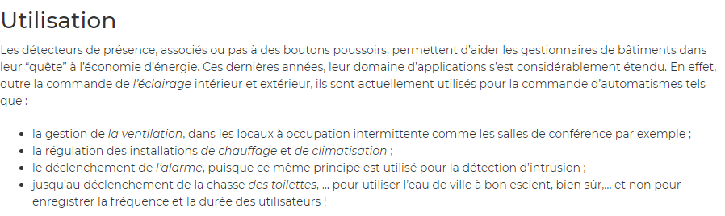

# Définitions
Voici des définitions utiles afin de comprendre les documents présentés dans les autres pages.

https://www.conrad.fr/articles/inspiration/fonctionnement-capteur-de-mouvement

- On peut aussi parler de "vision artificielle" ou "détection de présence" pour la détection de mouvement selon le degré de précision.

[ENERGIEPLUS. « Détecteurs de mouvement et de présence/absence [Éclairage] » In energieplus-lesite.be. 25 septembre 2007 [Consulté le 1 juin].](https://energieplus-lesite.be/techniques/eclairage10/commandes/gestion-en-fonction-de-la-presence/detecteurs-de-mouvement-et-de-presence-absence/)

- La motion capture fait référence plutôt à de la détection de coprs humain.

[MASSE, Jean-Thomas. Capture de mouvements humains par capteurs RGB-D. Thèse : Robotique et informatique : Toulouse, Université Toulouse III Paul Sabatier : 2015. 121p.](https://tel.archives-ouvertes.fr/tel-01280163v2/document)

Nota Bene : Les eventuels surlignages a été fait à postériori par moi-même. Ils ne sont pas dans le texte à l'origine. Pour une question de praticité, j'ai mis en avant les informations que j'ai estimé essentielles à cette page. N'hésitez pas à lire les sources pour vérifier et consolider vos connaissances sur le sujet.
