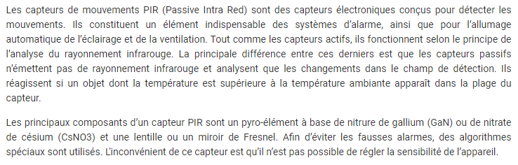

# Définitions
Voici des déinitions utiles afin de comprendre les documents présentés dans les autres pages.

https://www.conrad.fr/articles/inspiration/fonctionnement-capteur-de-mouvement
- On peut aussi parler de "vision artificielle" pour la détection de mouvement.
- f
- f
- f
- f
- f
- f
