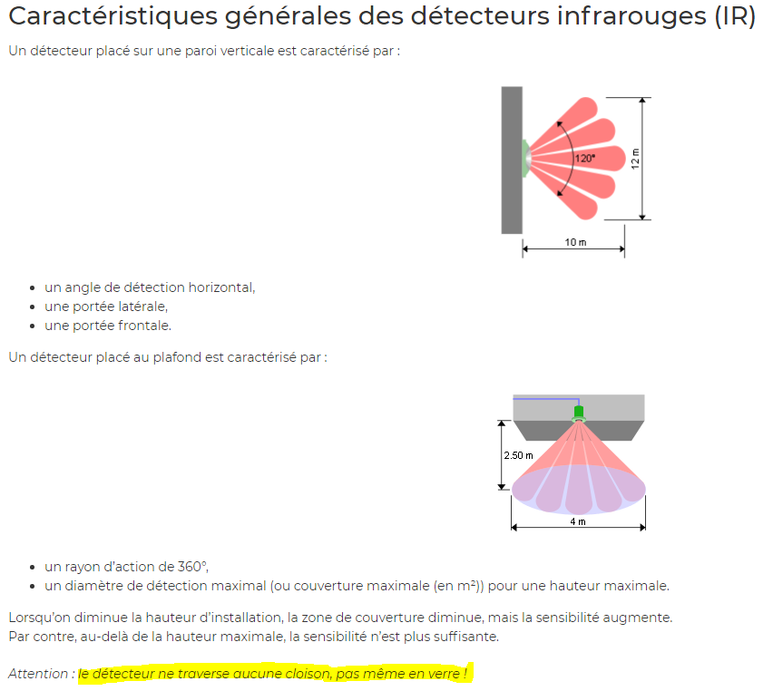
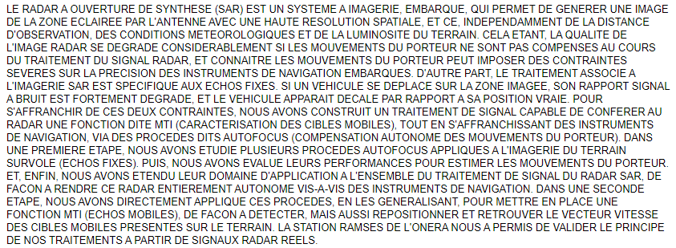

# Les erreurs fréquentes des détecteurs de mouvement.
Nota Bene : Les eventuels surlignages a été fait à postériori par moi-même. Ils ne sont pas dans le texte à l'origine. Pour une question de praticité, j'ai mis en avant les informations que j'ai estimé essentielles à cette page. N'hésitez pas à lire les sources pour vérifier et consolider vos connaissances sur le sujet.

## Détection des personnes par ultrason et par infrarouge

- [ENERGIEPLUS. « Détecteurs de mouvement et de présence/absence [Éclairage] » In energieplus-lesite.be. 25 septembre 2007 [Consulté le 1 juin].](https://energieplus-lesite.be/techniques/eclairage10/commandes/gestion-en-fonction-de-la-presence/detecteurs-de-mouvement-et-de-presence-absence/)

Pour affiner ses résultats et éviter ces erreurs, on peut combiner ces derniers avec un détecteur de chaleur. Son constructeur informe néanmoins :

- [VERISURE. Comment fonctionne un capteur de mouvement ? [En ligne]. Mise à jour ca février 2020 [Consulté le 07 juin 2020].](https://www.verisure.fr/guide-securite/systeme-d-alarme/composants-alarme/detecteur-de-mouvement/comment-fonctionne-un-capteur-de-mouvement)

## Détection des personnes et objets dans une vidéo

- [VAN DROOGENBROEK, Mark. Cours sur la détection de mouvement dans une vidéo : histoire d’une technologie et d’un brevet. Power-Point : INTELSIG, Montefiore Institute, Liège, Université de Liège : 15 mai 2012 [Consulté le 5 juin 2020].](https://orbi.uliege.be/bitstream/2268/121415/1/VanDroogenbroeck2012LaDetection.pdf)

## Détection radar et lazer

- [CARNEC, Claudie. "Interférométrie SAR différentielle application à la détection et au suivi de mouvement de mouvement de terrain". Thèse : Université Denis Diderot, Paris 7, 1996.](https://www.worldcat.org/title/interferometrie-sar-differentielle-application-a-la-detection-et-au-suivi-de-mouvements-de-terrain/oclc/36434958&referer=brief_results)

[RETOURNER A L'ACCUEIL](https://arrunae.github.io/projet-aori-ob/accueil)
