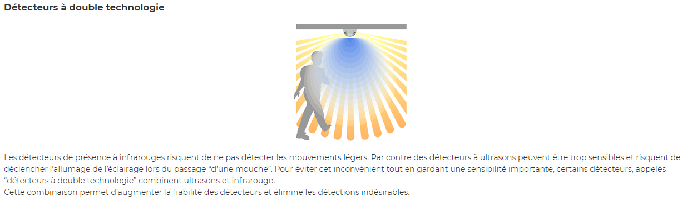
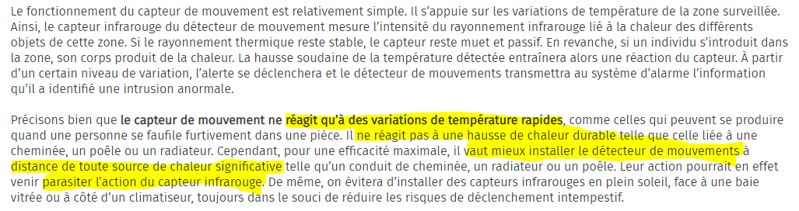
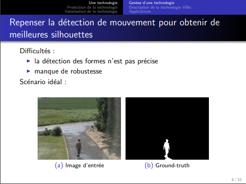

# Vous trouverez ici les informations liés aux erreurs fréquentes des détecteurs de mouvement.

## Détection des personnes par ultrason et par infrarouge

[ENERGIEPLUS. « Détecteurs de mouvement et de présence/absence [Éclairage] » In energieplus-lesite.be. 25 septembre 2007 [Consulté le 1 juin].](https://energieplus-lesite.be/techniques/eclairage10/commandes/gestion-en-fonction-de-la-presence/detecteurs-de-mouvement-et-de-presence-absence/)
Pour affiner ses résultats et éviter ces erreurs, on peut combiner ces derniers avec un détecteur de chaleur. Son constructeur informe néanmoins :

[VERISURE. Comment fonctionne un capteur de mouvement ? [En ligne]. Mise à jour ca février 2020 [Consulté le 07 juin 2020].](https://www.verisure.fr/guide-securite/systeme-d-alarme/composants-alarme/detecteur-de-mouvement/comment-fonctionne-un-capteur-de-mouvement)
(Le surlignage a été fait à postériori par moi-même)

## Détection des personnes et objets dans une vidéo

[VAN DROOGENBROEK, Mark. Cours sur la détection de mouvement dans une vidéo : histoire d’une technologie et d’un brevet. Power-Point : INTELSIG, Montefiore Institute, Liège, Université de Liège : 15 mai 2012 [Consulté le 5 juin 2020].](https://orbi.uliege.be/bitstream/2268/121415/1/VanDroogenbroeck2012LaDetection.pdf)

## 
