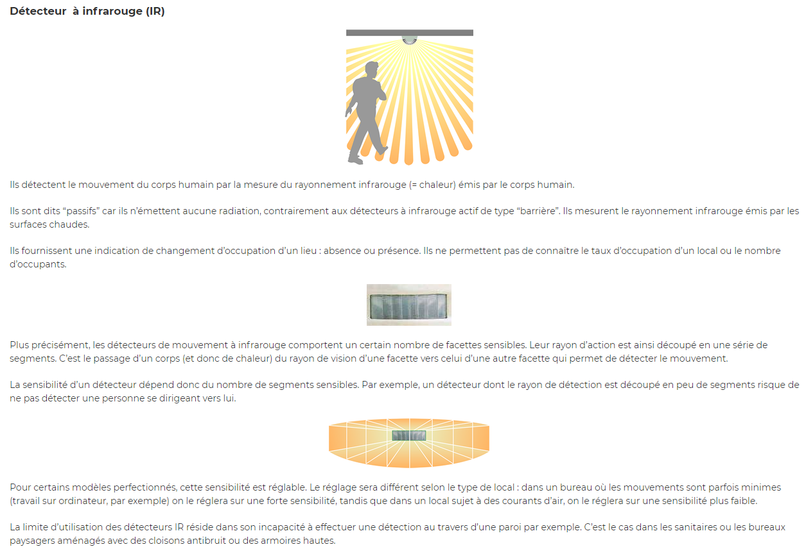
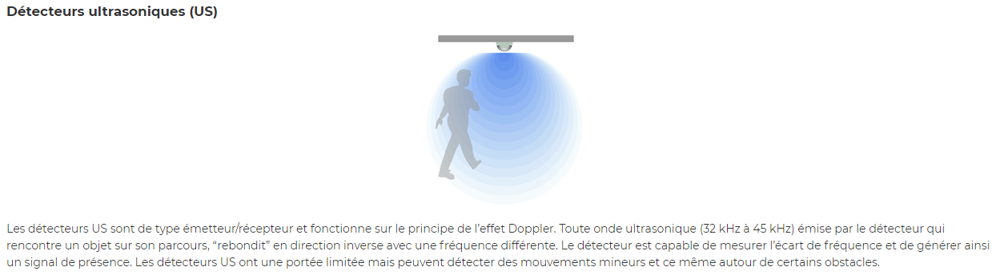
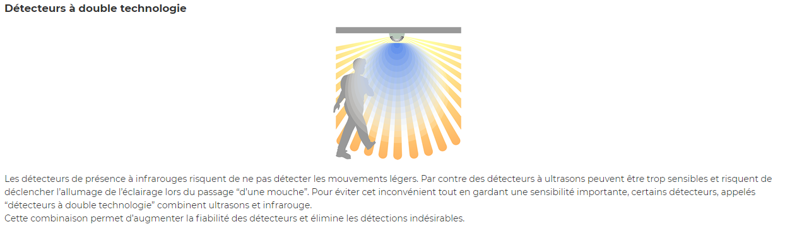
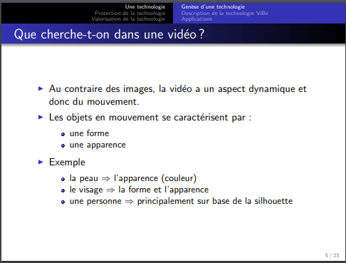
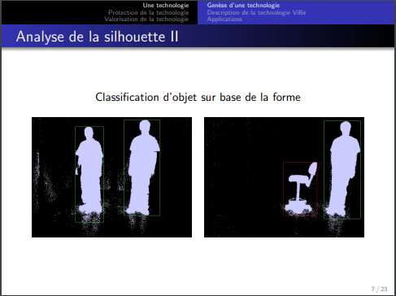
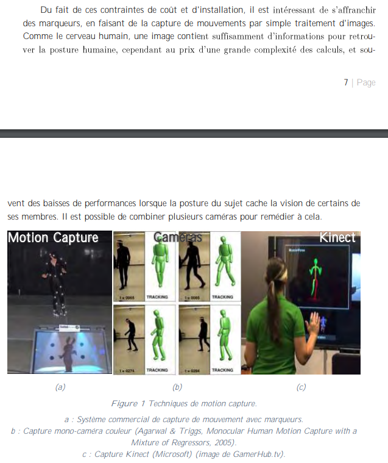
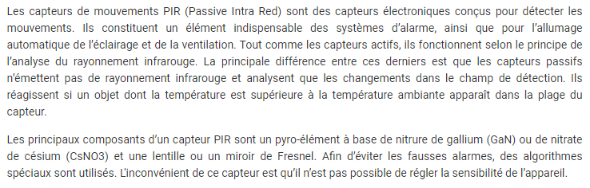
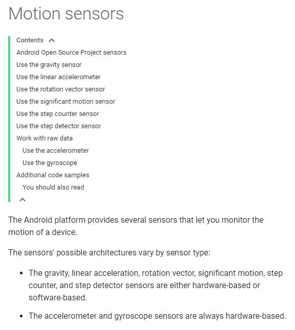
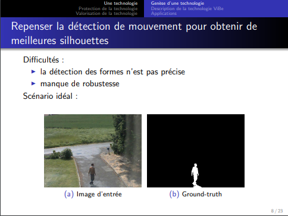
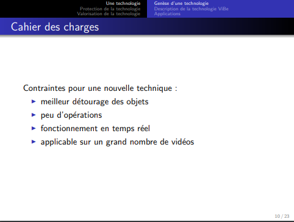

# Concernant le fonctionnement global des différents types de détecteurs de mouvements

## Détecteur infrarouge (IR)

## Détecteur ultrasoniques (US)

## Détecteur à double technologie

- [ENERGIEPLUS. « Détecteurs de mouvement et de présence/absence [Éclairage] » In energieplus-lesite.be. 25 septembre 2007 [Consulté le 1 juin].](https://energieplus-lesite.be/techniques/eclairage10/commandes/gestion-en-fonction-de-la-presence/detecteurs-de-mouvement-et-de-presence-absence/)

## Détecteur vidéo

- [VAN DROOGENBROEK, Mark. Cours sur la détection de mouvement dans une vidéo : histoire d’une technologie et d’un brevet. Power-Point : INTELSIG, Montefiore Institute, Liège, Université de Liège : 15 mai 2012 [Consulté le 5 juin 2020].](https://orbi.uliege.be/bitstream/2268/121415/1/VanDroogenbroeck2012LaDetection.pdf)

- [MASSE, Jean-Thomas. Capture de mouvements humains par capteurs RGB-D. Thèse : Robotique et informatique : Toulouse, Université Toulouse III Paul Sabatier : 2015. 121p.](https://tel.archives-ouvertes.fr/tel-01280163v2/document)

## Pour afiner les résultats
Détecteur de chaleur (PIR)

- [CONRAD. Fonctionnement des capteurs de mouvement. 27 mais 2019 [Consulté le 1 juin 2020].](https://www.conrad.fr/articles/inspiration/fonctionnement-capteur-de-mouvement)

# Exploiter la détection et la rendre intelligente

- [ANDROID. « Motion Sensors » In Developers : guides. Mise à jour 03 juin 2020 [Consulté le 07 juin 2020].](https://developer.android.com/guide/topics/sensors/sensors_motion)

- [VAN DROOGENBROEK, Mark. Cours sur la détection de mouvement dans une vidéo : histoire d’une technologie et d’un brevet. Power-Point : INTELSIG, Montefiore Institute, Liège, Université de Liège : 15 mai 2012 [Consulté le 5 juin 2020].]( https://orbi.uliege.be/bitstream/2268/121415/1/VanDroogenbroeck2012LaDetection.pdf)
