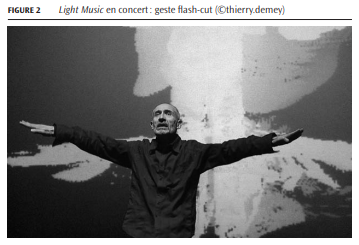

# Exemples d'utilisations pour la détection de mouvements

## Utilisations civiles

[Site energieplus-lesite.be de renseignement citoyens sur la consomation électrique](https://energieplus-lesite.be/techniques/eclairage10/commandes/gestion-en-fonction-de-la-presence/detecteurs-de-mouvement-et-de-presence-absence/)

[ETCHEVERRY, Céline et LAYERLE, Jean-François. "HOMME/MACHINE ET PROCEDE DE CONTROLE DE FONCTIONS D’UN VEHICULE PAR DETECTION DE MOUVEMENT ET/OU D’EXPRESSION DU CONDUCTEUR." WO2012/049411 A1 : 19 avril 2012. Organisation monsiale de la Propriété intellectuelle, 2012.](https://worldwide.espacenet.com/publicationDetails/biblio?FT=D&date=20160513&DB=EPODOC&locale=&CC=FR&NR=3028221A1)

[PINTSCH, Pascal. "Les détecteurs de mouvement pour l'extérieur." Police locale : Actualités. 22 janvier 2019 [consulté le 5 juin 2020].](https://www.police.be/5297/actualites/les-detecteurs-de-mouvement-pour-lexterieur)

## Utilisations professionnelles

Radard automobiles
[PEYREGNE, Rémi et FOURRIER-LAMER, Arlette. Caractérisation des cibles mobiles MTI et des compensation autofocus de synthèse SAR. Thèse : Électronique. Communication, micro-ondes et optiques : Limoges : 1997. 17p.](https://www.worldcat.org/title/caracterisation-des-cibles-mobiles-mti-et-compensation-autofocus-de-mouvements-dans-un-radar-de-cartographie-a-ouverture-de-synthese-sar/oclc/799085636&referer=brief_results)

Afin de suivre les mouvements de terrains et les prévenirs 
[CARNEC, Claudie. "Interferomètrie SAR différentielle application à la détection et au suivi de mouvement de mouvement de terrain". Thèse : Université Denis Diderot, Paris 7, 1996.](https://www.worldcat.org/title/interferometrie-sar-differentielle-application-a-la-detection-et-au-suivi-de-mouvements-de-terrain/oclc/36434958&referer=brief_results)

## Autres utilisations

[HÉON-MORISSETTE, Barah. "Rien dans les mains... Light Music de Thierry De Mey." [En ligne]. Circuit. 30 Avril 2012 [consulté le 07 juin 2020], vol. 22, n°1. p.41-50.](https://www.erudit.org/fr/revues/circuit/2012-v22-n1-circuit081/1008967ar/)

